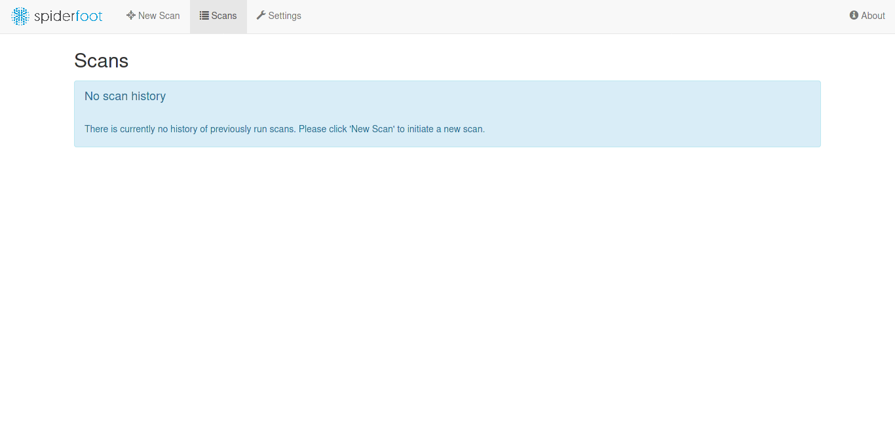
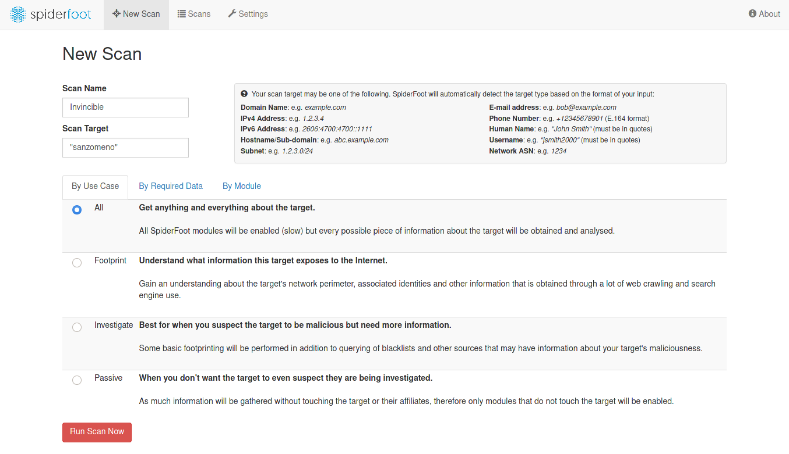

# Invincible

**Difficulty:** Medium  
**Points:** 100

## Challange Description

Our threat intelligence team has noticed suspicious behavior from the user sanzomeno can you trace him and find what he is trying to hide.

## Solution

### Required Tools & Skills

- Basic Linux commands
- Internet connection 
- [spiderfoot](https://www.spiderfoot.net/)

### Procedure

We are looking for a user named 'sanzomeno', and the website has not been provided. I this case we have to search every website for a user named 'sanzomeno'.

To do this, we use an OSINT tool known as sn0int. After installing sn0int run it by typing:  
```$ spiderfoot -l 127.0.0.1:1337```  
or  
```$ sudo spiderfoot -l 127.0.0.1:1337```

Once spiderfoot is up and running, open a browser then go to `127.0.0.1:1337`. Then the following webpage will appear:



Click on `New Scan` at the top of the page, then fill out the fields on the page as follows:



Press `Run Scan Now` button at the bottom of the page. Spiderfoot will start scanning and the following page will appear:


Once the `Status` becomes `FINISHED`, navigate to the `Browse` tab, and click on `Account on External Site`. The following page should appear:


We should then click on the website that seems to have that username. The following page should appear:  
  
It says the user has deleted the flag from his page in which case it means that at some point the flag was on the page. So, all we have to do is go back to the time when the flag was still on the page.

To do that we can use [The Wayback Machine](https://archive.org/web/). All we have to do is copy the full website of the page above then paste it on the wayback machine as follows, and press `BROWSE HISTORY`:


The next page will show us a calendar with all the times the webpage has been saved. After checking each snapshot (webpage saved) one by one, we will find a webpage that has the flag right in front, which is the flag that we need. All that is needed now is to submit the flag.

****
**HAPPY HACKING!!!**  
**[Anonymously-Me](https://github.com/Anonymously-Me)**
****
