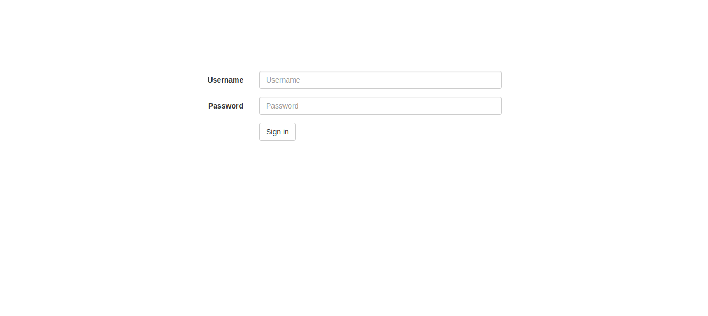
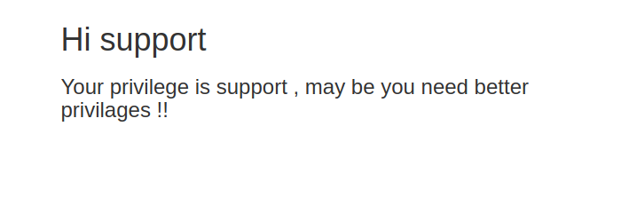

# Admin has the power

## Challenge Description

Administrators only has the power to see the flag , can you be one ?

## Solution

When we go to the link of the site we got the home with login form containing **username** and **password**

The first thing you should have in mind you got site like this is to go to the source code and have look at it. When we look at the source code there is alot of comments , after reading to the there is interesting comment that is:
> **TODO: remove this line ,  for maintenance purpose use this info (user:______ password:______)**

Then after we logged by using the username and password we got this 👇

Again blank Page with some text, we got to go to the source code there is the same.
From here we can take another approach, that is to see the cookie of the site. Because now we logged in there must be some cookie stored on the site(or other stored value to preserve the session of user)

after we looked at the cookie we can see there is two value:

    > **PHPSESSID** with value in it,
    > **role** with value in it.

> Do you know we can change the value of cookie ,  refresh the page and see the result.

after changing the role from support to admin (obvious change) we got the flag.

Done!!
Happy hacking,
Chapi Menge.
