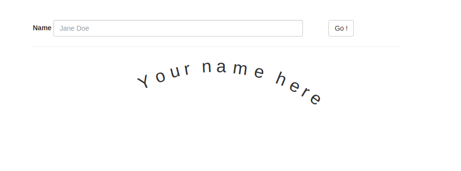

# Cool Name Effect

## Challenge Description

Webmaster developed a simple script to do cool effects on your name, but his code not filtering the inputs correctly execute javascript alert and prove it.

## Solution

As the description says i tried simple payload like 

`  `

 but it says 

`<[forbidden]> alert(1)`  

just another common payload worked 

`  `

Happy Hacking,

Chapi Menge
