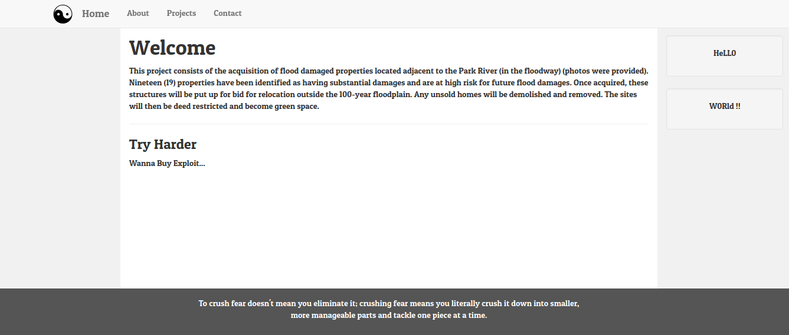
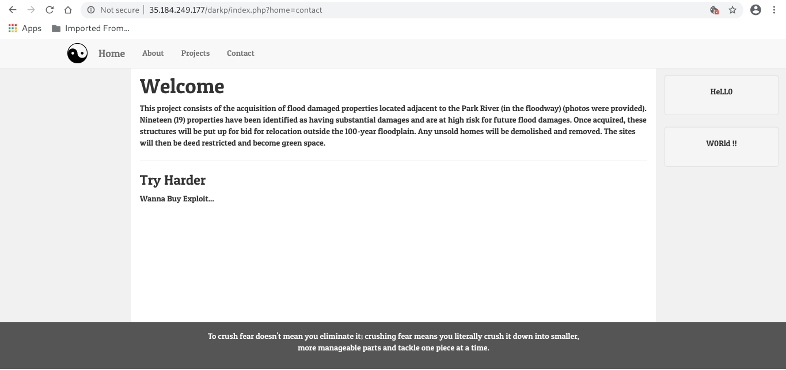
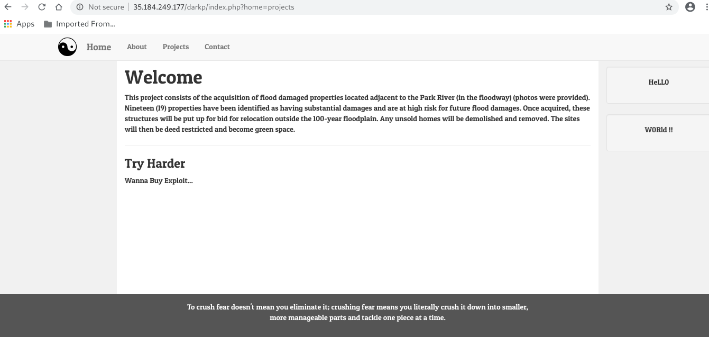
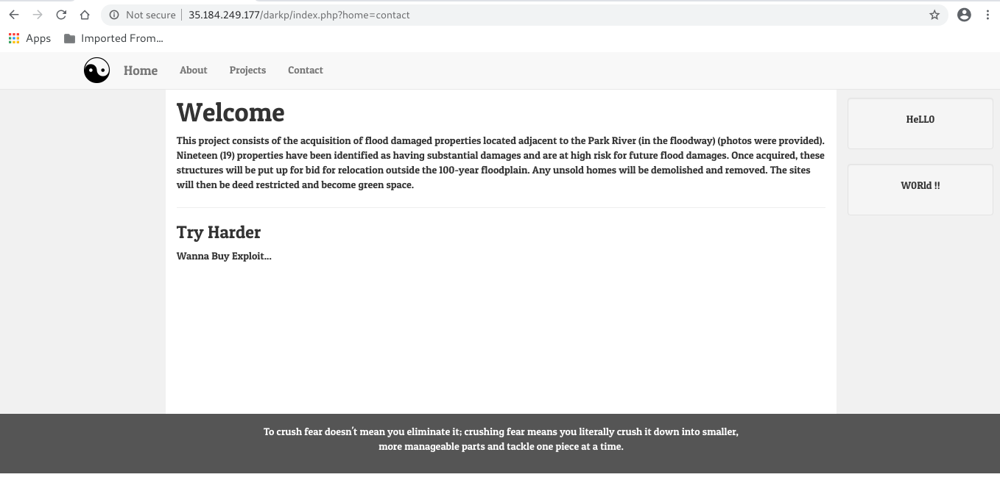

# Dark Project

## Challenge Description

What kind of Project are you seeking for ?

## Solution




This time the challenge is kinda tough. when i see the page the first thing that pop in mind was checking directory brute-forcing. I used [**Dirsearch**](https://github.com/maurosoria/dirsearch) to check hidden file but did get nothing.

I saw the source code got nothing, i explore many many thing in the site but i got nothing.

The next thing is that I start noticing the url that came when i click to other pages like:
    
    - darkp/index.php?home=about - the about page 


    - darkp/index.php?home=projects - the project page


    - darkp/index.php?home=contact - the contact page


As you can see the page are changing as the parameter passed to the index.php too. The paramenter **home** is pointing to some file obviously, then this site might be vulnerable Local File Inclusion (LFI). 

**What is a Local File Inclusion (LFI) vulnerability ?**

    Local File Inclusion (LFI) allows an attacker to include files on a server through the web browser. This vulnerability exists when a web application includes a file without correctly sanitising the input, allowing and attacker to manipulate the input and inject path traversal characters and include other files from the web server. 

[source to the above definition.](https://medium.com/@Aptive/local-file-inclusion-lfi-web-application-penetration-testing-cc9dc8dd3601)

So after some searching i found great article about **LFI** by [Gupta Bless](https://gupta-bless.medium.com/) 

[Exploiting Local File Inclusion (LFI) Using PHP Wrapper](https://gupta-bless.medium.com/exploiting-local-file-inclusion-lfi-using-php-wrapper-89904478b225) i recommended go and read it.

if we see all the pages the are requested from the index.php file then can we get our hand to index.php file ?

let's see what can we do with the article. After reading the article the i tried the payload:

```
page=php://filter/convert.base64-encode/resource=index
```
    This payload forces PHP to base64 encode the file before it is used or rendered in the response. Now we replace page parameter value with above-mentioned payload and check output.
    Gupta Bless

obviously we can change the **page** parameter to **home** to fit to our case. After changing the parameter it got successfully fetched the file.

.

But the response of the file is encoded in Base64 then we have to decode it.

To decode Base64:

1. You can terminal if you are using linux 

```bash
echo "file in base64" | base64 -d  
```

2. You can use online tools like :
    
    1. [https://www.base64decode.org/](https://www.base64decode.org/)
    2. [https://www.base64decode.net/](https://www.base64decode.net/)
    3. [https://base64.guru/converter/decode](https://base64.guru/converter/decode)
    and many more out there.

Finally when you decode you get php + html code and if you see at the beginning of the file you will get the flag.


Done.
Happy Hacking,
Chapi Menge
