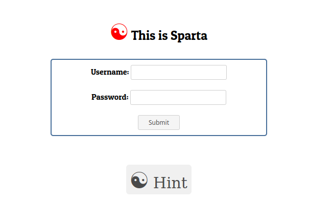

# This is Sparta

## Challenge Description

Morning has broken today they're fighting in the shade when arrows blocked the sun they fell tonight they dine in hell.

## Solution

The page is have login form , and one button.


As you can see here there is nothing , but if we open the source code we can notice that there is weird Javascript code inside the
script tag.

```javascript
<script>
var _0xae5b=["\x76\x61\x6C\x75\x65","\x75\x73\x65\x72","\x67\x65\x74\x45\x6C\x65\x6D\x65\x6E\x74\x42\x79\x49\x64","\x70\x61\x73\x73","\x43\x79\x62\x65\x72\x2d\x54\x61\x6c\x65\x6e\x74","\x20\x20\x20\x20\x20\x20\x20\x20\x20\x20\x20\x20\x20\x20\x20\x20\x20\x20\x20\x20\x20\x20\x43\x6F\x6E\x67\x72\x61\x74\x7A\x20\x0A\x0A","\x77\x72\x6F\x6E\x67\x20\x50\x61\x73\x73\x77\x6F\x72\x64"];function check(){var _0xeb80x2=document[_0xae5b[2]](_0xae5b[1])[_0xae5b[0]];var _0xeb80x3=document[_0xae5b[2]](_0xae5b[3])[_0xae5b[0]];if(_0xeb80x2==_0xae5b[4]&&_0xeb80x3==_0xae5b[4]){alert(_0xae5b[5]);} else {alert(_0xae5b[6]);}}
</script>
```

**wait what is going on ?**

**what is this code?**

Don't panic it is just javascript code written by hex value of the character. To change the ASCII character you have many option:

    > one is to change every character or,
    > copy and paste to javscript browser console ( first allow the pasting by typing **allow pasting** and enter) 
    on every singe line (till the ; )
    > another use online js code formatter
    > and any option to change the hex to ascii character.

after convertingthe hex code to ascii charater we can see that is checks the **username** and **password** in the `if` condition. Just enter the strings in the appropiriate value and Boom the flag.

Done!

Happy Hacking,

Chapi Menge.
